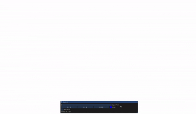

# ✏️ Simple Font Viewer + Bonus Icosahedron Dice  
### OpenGL 3.3 Core + ImGui | Computer Graphics Assignment #2

  

본 프로젝트는 TrueType 폰트 데이터에서 **곡선/직선 외곽선(outline)** 을 읽어  
OpenGL 3.3 Core 환경에서 직접 **벡터 형태로 글자를 렌더링**하고,  
ImGui 기반의 UI로 실시간 입력/색상 조절이 가능한  
**Simple Font Viewer** 프로젝트입니다.

또한 Extra Credit 과제로,  
글자 1~20개를 입력하면 **정20면체(Regular Icosahedron)** 주사위의  
각 면에 문자가 배치된 3D 회전 Dice도 함께 구현했습니다.

---

## 📌 Features (핵심 기능)

### 1️⃣ TrueType Outline Data Parsing
- 제공된 `times_font_partial.txt`에서  
  **각 문자(0–9, A–Z, a–z)의 외곽선 정보** 로드
- Outline 구성:
  - `L` : 직선(1차 Bézier)
  - `C` : 2차 Bézier 곡선
- 개별 contour 별로 point list 구성 후 OpenGL 렌더링 가능 구조로 변환

---

### 2️⃣ 벡터 기반 글자 렌더링 (OpenGL)
- 곡선/직선을 CPU에서 polyline으로 샘플링 → GPU 업로드
- 확대/축소해도 깨지지 않는 벡터 렌더링
- 문자 최대 **25자(5×5 grid)** 출력
- 숫자/알파벳만 필터링하여 렌더링
- 각 contour는 Line Loop으로 스트로크 렌더링

---

### 3️⃣ ImGui 실시간 UI 패널

  

- InputText: 실시간 텍스트 입력  
- ColorEdit3: 글자 스트로크 색상 변경  
- CheckBox: Dice 모드 활성화  
- 현재 입력된 유효 문자 수(최대 25자) 표시  
- UI는 실제 렌더링 위에 overlay 형식으로 구성

---

### 4️⃣ Extra Credit: 3D Icosahedron Dice
- 정20면체 정점/면/법선 데이터 직접 생성  
- 입력된 문자 중 **1~20개**가 각 면 중심(face center)에 매핑  
- 카메라 Projection 변화(ortho ↔ perspective)  
- 프레임마다 회전하며 3D space에서 문자 렌더링  
- 각 문자 contour 변환 후 face normal 기준 회전하여 붙임

---

## 🏗 Project Structure

